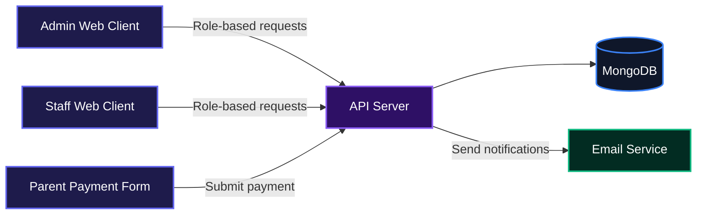
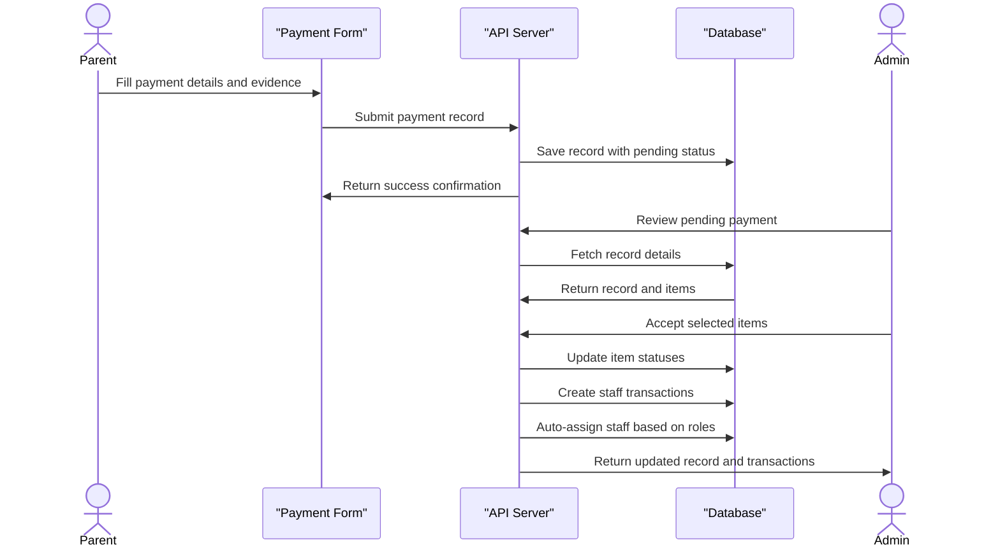
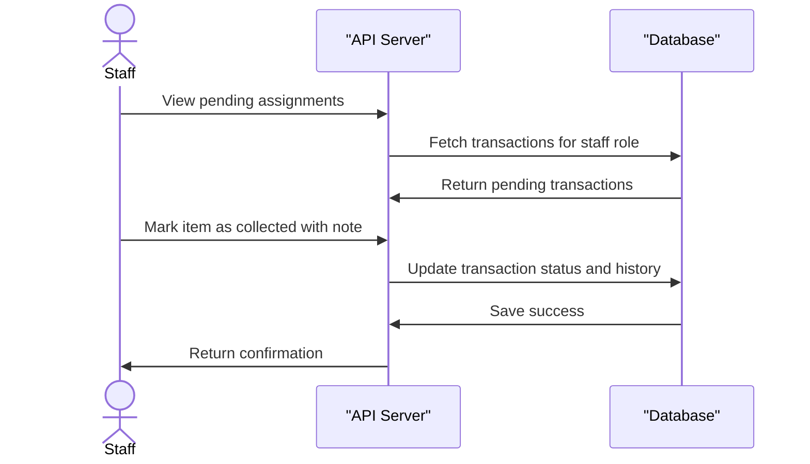

# Primary Colours School Management System

A full-stack school fee management platform for collecting, verifying, and tracking student payment submissions, staff assignments, and item distribution.

## Overview

Primary Colours School needed a way to manage fee collection and the physical distribution of school items without drowning in paperwork. This project solves that by giving parents a simple form to submit payments, admins a dashboard to verify and accept them, and staff a clear list of items to hand over. The whole flow, from payment evidence to collection confirmation, lives in one place.

## System Architecture

The application has three main clients: an admin panel, a staff portal, and a public payment form. All three talk to a single Express API that stores data in MongoDB and sends emails through an external email service.



## Features

- **Payment collection with evidence**: Parents submit payment records with either a text reference or an uploaded image. The image is compressed server-side before storage.
- **Role-based access control**: Admins and staff have separate portals. Staff only see transactions assigned to their roles.
- **Item and fee management**: Admins create sections, classes, fee items, and roles. Items can be scoped to the whole school, a specific section, or specific classes.
- **Payment verification and acceptance**: Admins review each payment, accept individual items, reject pending ones, and generate receipts. Accepted items automatically create staff transactions.
- **Staff assignment and handover tracking**: Staff see their pending assignments, mark items as collected, and view collection history with filters.
- **Configuration health monitoring**: A dedicated page highlights items that have no assigned role or no active staff, helping admins fix routing issues before payments get stuck.
- **Reports and dashboard analytics**: Admins get revenue breakdowns, monthly submission trends, and fulfillment pipeline status with PDF export.

### Payment Verification and Acceptance Flow

This is the core workflow when a parent submits a payment and the admin approves the items.



### Staff Assignment and Collection Flow

Once an item is accepted, staff can view their queue and mark handover as complete.



## Installation

### Prerequisites

- Node.js 18 or later
- pnpm (or npm/yarn)
- MongoDB instance (local or Atlas)

### Backend Setup

1. Clone the repository:
   ```bash
   git clone git@github-school:PrimaryColoursSchool01/Primary-Colours-School.git
   cd Primary-Colours-School/backend
   ```

2. Install dependencies:
   ```bash
   pnpm install
   ```

3. Create a `.env` file in the `backend` folder with the following variables:
   ```env
   PORT=5000
   JWT_SECRET=your_secure_jwt_secret
   FRONTEND_URL=http://localhost:5173
   EMAIL_SERVICE_URL=https://your-email-service.example/send
   ADMIN_EMAIL=admin@school.com
   ADMIN_PASSWORD=securepassword
   ```

4. Start the development server:
   ```bash
   pnpm dev
   ```

   The server runs on `http://localhost:5000` by default.

### Frontend Setup

1. Navigate to the frontend folder:
   ```bash
   cd ../frontend
   ```

2. Install dependencies:
   ```bash
   pnpm install
   ```

3. Create a `.env` file in the `frontend` folder:
   ```env
   VITE_API_URL=http://localhost:5000
   ```

4. Start the Vite development server:
   ```bash
   pnpm dev
   ```

   The frontend runs on `http://localhost:5173`.

## Usage

### Admin Portal

Admins log in and see a dashboard with payment statistics, monthly submissions, revenue breakdown, and a recent responses table. From the sidebar they can manage sections, classes, fee items, users, roles, and view configuration health. Payment responses are reviewed in the Responses page where they can accept individual items, reject pending ones, and send receipts.

### Staff Portal

Staff log in to their own dashboard with a welcome banner, pending count, and priority action list. They can navigate to assignments to see the full queue, mark items as collected (with an optional note), and browse collection history filtered by date and search.

### Parent Payment Form

While the form itself is a separate client in this setup, the API exposes a public endpoint to submit payment records. It accepts multipart/form-data for image evidence and JSON for text evidence.

## API Documentation

All endpoints are prefixed with the base URL `http://localhost:5000`. Most endpoints require an access token in the `Authorization: Bearer <token>` header. Admin-only routes additionally check the user type.

### Authentication Endpoints

#### POST /auth/login

**Description**: Authenticate a user and return an access token plus user info. Sets a refresh token in an HTTP-only cookie.

**Request**:
```json
{
  "email": "admin@school.com",
  "password": "yourpassword"
}
```

**Response**:
```json
{
  "accessToken": "eyJhbGciOiJIUzI1NiIs...",
  "user": {
    "id": "64f1a3c3f9b4b2a1c0d5e6f7",
    "email": "admin@school.com",
    "fullName": "System Admin",
    "roles": [],
    "userType": "admin",
    "status": "active"
  }
}
```

**Errors**:
- 400: Email and password required, invalid email format
- 401: Invalid credentials
- 403: Account suspended

#### POST /auth/forgot-password

**Description**: Sends a password reset link to the provided email if an account exists. Always returns success to avoid email enumeration.

**Request**:
```json
{
  "email": "user@example.com"
}
```

**Response**:
```json
{
  "message": "If an account exists with this email, you will receive a link to reset your password."
}
```

**Errors**:
- 400: Email required or invalid email format

#### POST /auth/reset-password

**Description**: Resets the user password using a token and new password.

**Request**:
```json
{
  "token": "reset_token_from_email",
  "newPassword": "newsecurepass"
}
```

**Response**:
```json
{
  "message": "Password has been reset successfully"
}
```

**Errors**:
- 400: Token and new password required, password too short, or invalid/expired token

#### POST /auth/change-password

**Description**: Changes the logged-in user's password. Requires authentication.

**Request**:
```json
{
  "currentPassword": "oldpass",
  "newPassword": "newpass"
}
```

**Response**:
```json
{
  "message": "Password changed successfully"
}
```

**Errors**:
- 400: Current password and new password required, password too short, or current password incorrect
- 401: Unauthorized

#### POST /auth/refresh-token

**Description**: Exchanges a valid refresh token cookie for a new access token and refresh token.

**Request**: No body required, but the refresh token must be in the cookie.

**Response**:
```json
{
  "accessToken": "new_access_token",
  "message": "Token refreshed successfully",
  "user": {
    "id": "64f1a3c3f9b4b2a1c0d5e6f7",
    "email": "admin@school.com",
    "fullName": "System Admin",
    "roles": [],
    "userType": "admin"
  }
}
```

**Errors**:
- 401: Refresh token missing, invalid, or revoked

#### POST /auth/logout

**Description**: Clears the refresh token cookie and invalidates the server-side refresh token.

**Request**: No body required.

**Response**:
```json
{
  "message": "Logged out successfully"
}
```

**Errors**:
- None typically

### Section Endpoints

#### GET /sections

**Description**: Returns all sections with their nested classes.

**Request**: No authentication required.

**Response**:
```json
{
  "message": "Sections fetched successfully",
  "sections": [
    {
      "_id": "64f1a3c3f9b4b2a1c0d5e6f7",
      "name": "Primary",
      "createdAt": "2024-01-01T00:00:00.000Z",
      "classes": [
        {
          "_id": "64f1a3c3f9b4b2a1c0d5e6f8",
          "name": "Primary 1"
        }
      ]
    }
  ]
}
```

**Errors**:
- 500: Internal server error

#### POST /sections

**Description**: Creates a new section. Requires admin authentication.

**Request**:
```json
{
  "name": "Secondary"
}
```

**Response**:
```json
{
  "message": "Section created successfully",
  "section": {
    "_id": "64f1a3c3f9b4b2a1c0d5e6f9",
    "name": "Secondary",
    "createdAt": "2024-01-01T00:00:00.000Z",
    "updatedAt": "2024-01-01T00:00:00.000Z"
  }
}
```

**Errors**:
- 400: Section name required
- 401: Unauthorized
- 403: Forbidden (not admin)

#### GET /sections/:id

**Description**: Returns a single section by ID.

**Response**:
```json
{
  "message": "Section fetched successfully",
  "section": {
    "_id": "64f1a3c3f9b4b2a1c0d5e6f7",
    "name": "Primary"
  }
}
```

**Errors**:
- 400: Section ID required
- 404: Section not found

#### PUT /sections/:id

**Description**: Updates a section name. Requires admin authentication.

**Request**:
```json
{
  "name": "Primary Section"
}
```

**Response**:
```json
{
  "message": "Section updated successfully",
  "section": {
    "_id": "64f1a3c3f9b4b2a1c0d5e6f7",
    "name": "Primary Section"
  }
}
```

**Errors**:
- 400: Section ID or name required
- 404: Section not found
- 401/403: Unauthorized or not admin

#### DELETE /sections/:id

**Description**: Deletes a section after checking for payment records and transactions. Requires admin authentication.

**Response**:
```json
{
  "message": "Section deleted successfully",
  "section": {
    "_id": "64f1a3c3f9b4b2a1c0d5e6f7",
    "name": "Primary Section"
  }
}
```

**Errors**:
- 400: Cannot delete due to existing payment records or transactions
- 404: Section not found

### Class Endpoints

#### GET /classes

**Description**: Returns all classes with their section name.

**Response**:
```json
{
  "message": "Classes fetched successfully",
  "classes": [
    {
      "_id": "64f1a3c3f9b4b2a1c0d5e6f8",
      "name": "Primary 1",
      "sectionId": {
        "_id": "64f1a3c3f9b4b2a1c0d5e6f7",
        "name": "Primary"
      }
    }
  ]
}
```

**Errors**:
- 500: Internal server error

#### POST /classes

**Description**: Creates a new class under a section. Requires admin authentication.

**Request**:
```json
{
  "name": "JSS 1",
  "sectionId": "64f1a3c3f9b4b2a1c0d5e6f7"
}
```

**Response**:
```json
{
  "message": "Class created successfully",
  "class": {
    "_id": "64f1a3c3f9b4b2a1c0d5e6fa",
    "name": "JSS 1",
    "sectionId": "64f1a3c3f9b4b2a1c0d5e6f7"
  }
}
```

**Errors**:
- 400: Class name and section ID required, or duplicate name
- 401/403

#### GET /classes/:id

**Description**: Returns a single class by ID.

**Response**:
```json
{
  "message": "Class fetched successfully",
  "class": {
    "_id": "64f1a3c3f9b4b2a1c0d5e6fa",
    "name": "JSS 1",
    "sectionId": {
      "_id": "64f1a3c3f9b4b2a1c0d5e6f7",
      "name": "Secondary"
    }
  }
}
```

**Errors**:
- 400: Class ID required
- 404: Class not found

#### PUT /classes/:id

**Description**: Updates a class name. Requires admin authentication.

**Request**:
```json
{
  "name": "JSS 2"
}
```

**Response**:
```json
{
  "message": "Class updated successfully",
  "class": {
    "_id": "64f1a3c3f9b4b2a1c0d5e6fa",
    "name": "JSS 2"
  }
}
```

**Errors**:
- 400: Class ID or name required, duplicate name
- 404: Class not found

#### DELETE /classes/:id

**Description**: Deletes a class after checking for payment records and transactions. Requires admin authentication.

**Response**:
```json
{
  "message": "Class deleted successfully",
  "class": {
    "_id": "64f1a3c3f9b4b2a1c0d5e6fa",
    "name": "JSS 2"
  }
}
```

**Errors**:
- 400: Cannot delete due to existing payment records or transactions
- 404: Class not found

### Item Endpoints

#### GET /item

**Description**: Returns all fee items with section and class information.

**Response**:
```json
{
  "success": true,
  "message": "Items fetched successfully",
  "data": [
    {
      "_id": "64f1a3c3f9b4b2a1c0d5e6fb",
      "name": "Sports Fee",
      "price": 5000,
      "compulsory": true,
      "scope": "global"
    }
  ]
}
```

**Errors**:
- 500: Internal server error

#### POST /item

**Description**: Creates a new fee item. Requires admin authentication.

**Request**:
```json
{
  "name": "Excursion Fee",
  "price": 2500,
  "compulsory": false,
  "scope": "section",
  "sectionId": "64f1a3c3f9b4b2a1c0d5e6f7",
  "classIds": []
}
```

**Response**:
```json
{
  "success": true,
  "message": "Item created successfully",
  "data": {
    "_id": "64f1a3c3f9b4b2a1c0d5e6fc",
    "name": "Excursion Fee",
    "price": 2500,
    "compulsory": false,
    "scope": "section",
    "sectionId": "64f1a3c3f9b4b2a1c0d5e6f7",
    "classIds": []
  }
}
```

**Errors**:
- 400: Invalid input data
- 401/403

#### GET /item/:id

**Description**: Returns a single item by ID.

**Response**:
```json
{
  "success": true,
  "message": "Item fetched successfully",
  "data": {
    "_id": "64f1a3c3f9b4b2a1c0d5e6fb",
    "name": "Sports Fee",
    "price": 5000,
    "compulsory": true,
    "scope": "global"
  }
}
```

**Errors**:
- 404: Item not found

#### PUT /item/:id

**Description**: Updates an existing item. Requires admin authentication.

**Request** (partial update allowed):
```json
{
  "price": 6000,
  "compulsory": true
}
```

**Response**:
```json
{
  "success": true,
  "message": "Item updated successfully",
  "data": {
    "_id": "64f1a3c3f9b4b2a1c0d5e6fb",
    "name": "Sports Fee",
    "price": 6000,
    "compulsory": true,
    "scope": "global"
  }
}
```

**Errors**:
- 400: Invalid input data
- 404: Item not found

#### DELETE /item/:id

**Description**: Deletes an item. Fails if there are existing transactions. Requires admin authentication.

**Response**:
```json
{
  "success": true,
  "message": "Item deleted successfully",
  "data": {
    "_id": "64f1a3c3f9b4b2a1c0d5e6fb",
    "name": "Sports Fee"
  }
}
```

**Errors**:
- 400: Cannot delete due to existing transactions
- 404: Item not found

### Role Endpoints

All role endpoints require admin authentication.

#### GET /roles

**Description**: Returns all roles with populated section, class, and item details.

**Response**:
```json
{
  "message": "Roles fetched successfully",
  "roles": [
    {
      "_id": "64f1a3c3f9b4b2a1c0d5e6fd",
      "name": "Primary Bursar",
      "scope": "section",
      "sectionId": {
        "_id": "64f1a3c3f9b4b2a1c0d5e6f7",
        "name": "Primary"
      },
      "classIds": [],
      "itemIds": [
        {
          "_id": "64f1a3c3f9b4b2a1c0d5e6fb",
          "name": "Sports Fee"
        }
      ]
    }
  ]
}
```

**Errors**:
- 401/403

#### POST /roles

**Description**: Creates a new role with scope and item assignments.

**Request**:
```json
{
  "name": "Primary Bursar",
  "selectionType": "section-all-classes",
  "sectionId": "64f1a3c3f9b4b2a1c0d5e6f7",
  "classIds": [],
  "itemIds": ["64f1a3c3f9b4b2a1c0d5e6fb"]
}
```

**Response**:
```json
{
  "message": "Role created successfully",
  "role": {
    "_id": "64f1a3c3f9b4b2a1c0d5e6fd",
    "name": "Primary Bursar",
    "scope": "section",
    "sectionId": "64f1a3c3f9b4b2a1c0d5e6f7",
    "classIds": [],
    "itemIds": ["64f1a3c3f9b4b2a1c0d5e6fb"]
  }
}
```

**Errors**:
- 400: Missing fields or invalid selection type

#### GET /roles/:id

**Description**: Returns a single role by ID.

**Response**:
```json
{
  "message": "Role fetched successfully",
  "role": {
    "_id": "64f1a3c3f9b4b2a1c0d5e6fd",
    "name": "Primary Bursar"
  }
}
```

**Errors**:
- 400: Role ID required
- 404: Role not found

#### PUT /roles/:id

**Description**: Updates a role. Requires admin authentication.

**Request**:
```json
{
  "name": "Senior Bursar",
  "itemIds": ["64f1a3c3f9b4b2a1c0d5e6fb"],
  "selectionType": "all-sections"
}
```

**Response**:
```json
{
  "message": "Role updated successfully",
  "role": {
    "_id": "64f1a3c3f9b4b2a1c0d5e6fd",
    "name": "Senior Bursar",
    "scope": "global"
  }
}
```

**Errors**:
- 400: Missing or invalid fields
- 404: Role not found

#### DELETE /roles/:id

**Description**: Deletes a role. Performs cleanup on users and transactions. Requires admin authentication.

**Response**:
```json
{
  "message": "Role deleted successfully",
  "role": {
    "_id": "64f1a3c3f9b4b2a1c0d5e6fd",
    "name": "Senior Bursar"
  },
  "affectedUsers": 0
}
```

**Errors**:
- 400: Role ID required
- 404: Role not found

#### GET /roles/:id/dependencies

**Description**: Returns the number of users and items currently associated with a role.

**Response**:
```json
{
  "success": true,
  "data": {
    "users": 2,
    "items": 3
  }
}
```

**Errors**:
- 404: Role not found

### Payment Record Endpoints

#### POST /payment-records

**Description**: Public endpoint for parents to submit a new payment record. Accepts multipart/form-data for image evidence or JSON for text evidence.

**Request (multipart/form-data)**:

- `nameOfChild`: string
- `classId`: string
- `nameOfPayerOrCompany`: string
- `dateOfPayment`: string (date)
- `modeOfPayment`: one of `cash, bank-transfer, ussd, pos, mobile-wallet, internet-banking, direct-bank-deposit, other`
- `otherModeOfPayment`: optional if mode is `other`
- `bankOrPaymentSourceName`: string
- `term`: optional string
- `session`: string
- `items`: JSON string like `[{"itemId":"...","quantity":2}]`
- `paymentEvidenceType`: `text` or `image`
- `paymentEvidenceText`: optional text reference
- `evidenceImage`: optional file (max 2MB)

**Response**:
```json
{
  "message": "Payment record created successfully",
  "paymentRecord": {
    "_id": "64f1a3c3f9b4b2a1c0d5e6fe",
    "status": "pending",
    "totalAmount": 10000,
    "items": [
      {
        "itemId": "64f1a3c3f9b4b2a1c0d5e6fb",
        "quantity": 2,
        "amountAtPayment": 5000,
        "status": "pending"
      }
    ]
  }
}
```

**Errors**:
- 400: Missing required fields, invalid items, or image too large
- 404: Class or item not found

#### GET /payment-records

**Description**: Returns all payment records with filters. Requires admin authentication.

**Query Parameters**:
- `status`: `pending, accepted, partially_accepted, rejected, all`
- `classId`: class ID
- `startDate`, `endDate`: date range
- `search`: search by child or payer name
- `page`, `limit`: pagination (default page 1, limit 20)

**Response**:
```json
{
  "message": "Payment records fetched successfully",
  "count": 20,
  "total": 45,
  "page": 1,
  "totalPages": 3,
  "paymentRecords": [
    {
      "_id": "64f1a3c3f9b4b2a1c0d5e6fe",
      "nameOfChild": "John Doe",
      "status": "pending"
    }
  ]
}
```

**Errors**:
- 401/403: Unauthorized

#### GET /payment-records/:id

**Description**: Returns a single payment record with item transactions. Requires admin authentication.

**Response**:
```json
{
  "message": "Payment record fetched successfully",
  "paymentRecord": {
    "_id": "64f1a3c3f9b4b2a1c0d5e6fe",
    "status": "pending",
    "items": []
  },
  "itemTransactions": []
}
```

**Errors**:
- 400: Payment record ID required
- 404: Payment record not found

#### PUT /payment-records/:id

**Description**: Accepts selected items or rejects pending items. Requires admin authentication.

**Request for accept action**:
```json
{
  "action": "accept",
  "acceptedItemIds": ["item_id_1", "item_id_2"]
}
```

**Request for reject action**:
```json
{
  "action": "reject",
  "rejectionReason": "Payment amount mismatch"
}
```

**Response (accept)**:
```json
{
  "message": "Payment record updated",
  "paymentRecord": {
    "status": "partially_accepted"
  },
  "createdTransactions": []
}
```

**Response (reject)**:
```json
{
  "message": "Payment record rejected"
}
```

**Errors**:
- 400: Invalid action or missing fields
- 404: Payment record not found

### User Endpoints

All user endpoints require admin authentication.

#### GET /users

**Description**: Returns all users with filters and pagination.

**Query Parameters**:
- `userType`: `admin, staff`
- `status`: `active, suspended, inactive`
- `search`: search by full name or email
- `page`, `limit`: pagination

**Response**:
```json
{
  "message": "Users fetched successfully",
  "count": 10,
  "total": 25,
  "page": 1,
  "totalPages": 3,
  "users": [
    {
      "_id": "64f1a3c3f9b4b2a1c0d5e6ff",
      "fullName": "Jane Smith",
      "email": "jane@school.com",
      "userType": "staff",
      "status": "active",
      "roles": ["64f1a3c3f9b4b2a1c0d5e6fd"]
    }
  ]
}
```

**Errors**:
- 401/403

#### GET /users/:id

**Description**: Returns a single user by ID.

**Response**:
```json
{
  "message": "User fetched successfully",
  "user": {
    "_id": "64f1a3c3f9b4b2a1c0d5e6ff",
    "fullName": "Jane Smith",
    "email": "jane@school.com",
    "userType": "staff",
    "roles": [],
    "status": "active"
  }
}
```

**Errors**:
- 400: User ID required
- 404: User not found

#### POST /users

**Description**: Creates a new user (admin or staff) with roles.

**Request**:
```json
{
  "fullName": "Jane Smith",
  "email": "jane@school.com",
  "password": "temppass123",
  "userType": "staff",
  "roleIds": ["64f1a3c3f9b4b2a1c0d5e6fd"]
}
```

**Response**:
```json
{
  "message": "User registered successfully",
  "user": {
    "_id": "64f1a3c3f9b4b2a1c0d5e6ff",
    "fullName": "Jane Smith",
    "email": "jane@school.com",
    "userType": "staff",
    "roles": ["64f1a3c3f9b4b2a1c0d5e6fd"],
    "status": "active"
  }
}
```

**Errors**:
- 400: Missing fields or password too short
- 409: Email already in use
- 404: One or more roles not found

#### PUT /users/:id

**Description**: Updates user details, roles, or status. Requires admin authentication.

**Request**:
```json
{
  "fullName": "Jane Johnson",
  "email": "jane.johnson@school.com",
  "roleIds": ["64f1a3c3f9b4b2a1c0d5e6fd"],
  "status": "active"
}
```

**Response**:
```json
{
  "message": "User updated successfully",
  "user": {
    "_id": "64f1a3c3f9b4b2a1c0d5e6ff",
    "fullName": "Jane Johnson",
    "email": "jane.johnson@school.com",
    "status": "active"
  }
}
```

**Errors**:
- 400: Invalid fields
- 404: User not found
- 409: Email already in use

#### POST /users/:id/no-longer-working

**Description**: Marks a user as inactive. Requires admin authentication.

**Response**:
```json
{
  "message": "User marked as no longer working",
  "user": {
    "status": "inactive"
  }
}
```

**Errors**:
- 400: User ID required or user already inactive
- 404: User not found

#### POST /users/:id/suspend

**Description**: Suspends a user. Requires admin authentication.

**Response**:
```json
{
  "message": "User suspended successfully"
}
```

**Errors**:
- 400: User already suspended or inactive
- 404: User not found

#### POST /users/:id/unsuspend

**Description**: Unsuspends a user. Requires admin authentication.

**Response**:
```json
{
  "message": "User unsuspended successfully"
}
```

**Errors**:
- 400: User not suspended
- 404: User not found

#### POST /users/:id/reset-password

**Description**: Resets a user's password and sends them a new temporary password via email. Requires admin authentication.

**Request**:
```json
{
  "newPassword": "newtemp123"
}
```

**Response**:
```json
{
  "message": "Password reset successfully"
}
```

**Errors**:
- 400: User ID or new password required, password too short
- 404: User not found

### Dashboard Endpoints

#### GET /dashboard

**Description**: Returns admin dashboard data including stats, monthly submissions, revenue breakdown, and pipeline status. Requires admin authentication.

**Response**:
```json
{
  "success": true,
  "data": {
    "stats": {
      "total": 120,
      "pending": 30,
      "partially_accepted": 10,
      "accepted": 80,
      "rejected": 5,
      "totalRevenue": 500000,
      "pendingRevenue": 150000
    },
    "monthlySubmissions": [],
    "revenueBreakdown": [],
    "pipelineStatus": []
  }
}
```

**Errors**:
- 401/403

#### GET /dashboard/recent

**Description**: Returns recent payment responses with pagination. Requires admin authentication.

**Query Parameters**:
- `page`, `limit`

**Response**:
```json
{
  "success": true,
  "data": {
    "recentResponses": [],
    "pagination": {
      "total": 100,
      "page": 1,
      "pages": 10
    }
  }
}
```

**Errors**:
- 401/403

### Report Endpoints

#### GET /reports/payment-summary

**Description**: Returns comprehensive payment summary with filters. Requires admin authentication.

**Query Parameters**:
- `startDate`, `endDate`
- `classId`
- `status`

**Response**:
```json
{
  "success": true,
  "data": {
    "summary": {
      "totalAmount": 500000,
      "pendingRevenue": 150000,
      "acceptedCount": 80,
      "partiallyAcceptedCount": 10,
      "pendingCount": 30,
      "rejectedCount": 5,
      "totalCount": 120,
      "paymentModes": {
        "bank": {"count": 50, "amount": 300000, "percentage": 60},
        "cash": {"count": 20, "amount": 100000, "percentage": 20}
      }
    },
    "itemFulfillment": {
      "totalItems": 200,
      "collected": 150,
      "pending": 50,
      "noRole": 5,
      "noStaff": 3,
      "collectionRate": 75
    },
    "topPendingItems": [],
    "byClass": []
  }
}
```

**Errors**:
- 401/403

### Profile Endpoints

#### GET /profile

**Description**: Returns the current user's profile. Requires authentication.

**Response**:
```json
{
  "id": "64f1a3c3f9b4b2a1c0d5e6ff",
  "fullName": "Jane Smith",
  "email": "jane@school.com",
  "phone": "+2348012345678",
  "userType": "staff",
  "roles": ["Primary Bursar"],
  "status": "active"
}
```

**Errors**:
- 401

#### PUT /profile

**Description**: Updates the current user's full name and phone. Requires authentication.

**Request**:
```json
{
  "fullName": "Jane Johnson",
  "phone": "+2348012345678"
}
```

**Response**:
```json
{
  "message": "Updated",
  "user": {
    "id": "64f1a3c3f9b4b2a1c0d5e6ff",
    "fullName": "Jane Johnson",
    "email": "jane@school.com",
    "phone": "+2348012345678"
  }
}
```

**Errors**:
- 400: Name required

#### POST /profile/logout-all

**Description**: Invalidates all other sessions by increasing token version. Requires authentication.

**Response**:
```json
{
  "message": "All other sessions logged out"
}
```

**Errors**:
- 401

### Staff Endpoints

All staff endpoints require authentication with userType `staff`.

#### GET /staff/dashboard

**Description**: Returns staff dashboard data including welcome info, stats, and priority actions.

**Response**:
```json
{
  "success": true,
  "message": "Dashboard loaded successfully",
  "data": {
    "welcome": {
      "name": "Jane",
      "date": "2024-01-01"
    },
    "stats": {
      "pending": 15,
      "collectedToday": 3
    },
    "priorityActions": []
  }
}
```

**Errors**:
- 401/403

#### GET /staff/assignments

**Description**: Returns paginated pending assignments for the current staff member.

**Query Parameters**:
- `page`, `limit`
- `classId`
- `search`

**Response**:
```json
{
  "success": true,
  "message": "Assignments fetched successfully",
  "data": {
    "transactions": [],
    "total": 15,
    "page": 1,
    "pages": 1
  }
}
```

**Errors**:
- 401/403

#### POST /staff/transactions/:id/collect

**Description**: Marks a pending transaction as collected. Requires staff authentication.

**Request**:
```json
{
  "note": "Student collected in person"
}
```

**Response**:
```json
{
  "success": true,
  "message": "Item marked as collected successfully",
  "data": {
    "transactionId": "64f1a3c3f9b4b2a1c0d5e700",
    "status": "collected",
    "handedOverAt": "2024-01-01T00:00:00.000Z"
  }
}
```

**Errors**:
- 400: Transaction ID required or transaction not pending
- 403: Not authorized to collect this item

#### GET /staff/history

**Description**: Returns collection history for the current staff member with filters.

**Query Parameters**:
- `page`, `limit`
- `startDate`, `endDate`
- `classId`
- `search`

**Response**:
```json
{
  "success": true,
  "message": "History fetched successfully",
  "data": {
    "transactions": [],
    "total": 50,
    "page": 1,
    "pages": 3
  }
}
```

**Errors**:
- 401/403

#### GET /staff/classes

**Description**: Returns classes based on the current staff's assigned items.

**Response**:
```json
{
  "success": true,
  "message": "Classes fetched successfully",
  "data": {
    "classes": []
  }
}
```

**Errors**:
- 401/403

### Configuration Health Endpoint

#### GET /configuration-health

**Description**: Returns items that have no assigned role or no active staff, along with summary stats. Requires authentication.

**Response**:
```json
{
  "success": true,
  "data": {
    "summary": {
      "noRoleItemsCount": 2,
      "noStaffItemsCount": 1,
      "totalAffectedTransactions": 5
    },
    "noRoleItems": [
      {
        "itemId": "64f1a3c3f9b4b2a1c0d5e6fb",
        "itemName": "Sports Fee",
        "affectedTransactions": 3
      }
    ],
    "noStaffItems": []
  }
}
```

**Errors**:
- 401

## Technologies Used

| Technology | Purpose |
|------------|---------|
| [Node.js](https://nodejs.org/) | JavaScript runtime for the backend |
| [Express](https://expressjs.com/) | Web framework for building the REST API |
| [MongoDB](https://www.mongodb.com/) | NoSQL database for storing all data |
| [Mongoose](https://mongoosejs.com/) | ODM for MongoDB |
| [React](https://react.dev/) | Frontend library |
| [Vite](https://vitejs.dev/) | Frontend build tool |
| [Tailwind CSS](https://tailwindcss.com/) | Utility-first CSS framework |
| [Shadcn UI](https://ui.shadcn.com/) | UI component library |
| [Zustand](https://zustand-demo.pmnd.rs/) | State management |
| [React Router](https://reactrouter.com/) | Client-side routing |
| [Axios](https://axios-http.com/) | HTTP client |
| [React Hook Form](https://react-hook-form.com/) | Form management |
| [Zod](https://zod.dev/) | Schema validation |
| [Recharts](https://recharts.org/) | Charting library |
| [jsPDF](https://github.com/parallax/jsPDF) | PDF generation on the client |
| [Sharp](https://sharp.pixelplumbing.com/) | Image processing for payment evidence |
| [JWT](https://jwt.io/) | Access and refresh token management |
| [bcrypt](https://github.com/kelektiv/node.bcrypt.js) | Password hashing |

## Contributing

Contributions are welcome. Feel free to open an issue or submit a pull request. Please follow the existing code style and write clear commit messages.

## Author Info

- LinkedIn: [Ahmad Ibrahim](https://linkedin.com/in/ahmadibrahim06)
- X (Twitter): [@undefined_dev](https://x.com/undefined_dev)

## Badges

[](https://nodejs.org/)
[](https://expressjs.com/)
[](https://www.mongodb.com/)
[](https://react.dev/)
[](https://vitejs.dev/)
[](https://tailwindcss.com/)
[](https://jwt.io/)

[](https://dokugen.samueltuoyo.com)