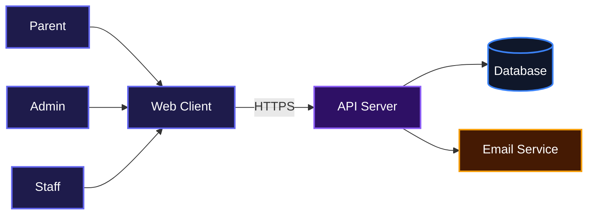
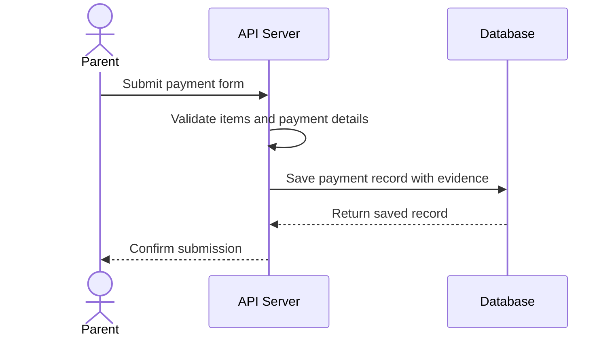
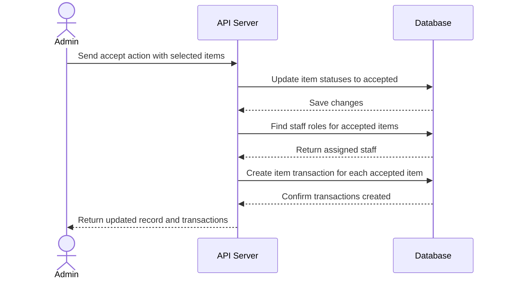
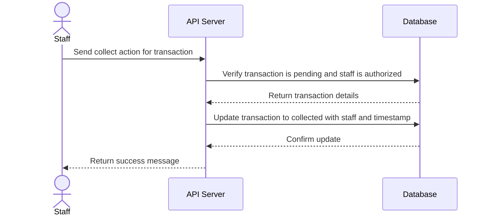

# Primary Colours School Fee Management System

A backend system that simplifies school fee collection, payment verification, and item distribution for staff.

## Overview

Running a school involves more than just collecting fees. You need a clear record of who paid, who approved it, and who handed out what. This project solves that by giving parents a simple payment form, admins a clean review dashboard, and staff a focused list of items to distribute. It keeps everything organized in one place and reduces the confusion that comes with spreadsheets and paper receipts.



## Installation

1. Clone the repository:

```bash
git clone git@github-school:PrimaryColoursSchool01/Primary-Colours-School.git
```

2. Move into the project folder:

```bash
cd Primary-Colours-School
```

3. Install dependencies:

```bash
npm install
```

If you use `pnpm`, run:

```bash
pnpm install
```

4. Create a `.env` file in the root directory and add the required variables:

```bash
PORT=5000
NODE_ENV=development
JWT_SECRET=your_super_secret_key
MONGODB_URI=mongodb://localhost:27017/school_fees
FRONTEND_URL=http://localhost:5173
FORM_URL=http://localhost:5174
ADMIN_EMAIL=admin@example.com
ADMIN_PASSWORD=securepassword
EMAIL_SERVICE_URL=https://email-service.example.com/send
```

5. Start the development server:

```bash
npm run dev
```

For production, use:

```bash
npm start
```

## Usage

The backend runs as an HTTP API. You can interact with it using tools like Postman, curl, or a frontend client. Here is a quick example that logs in an admin:

```bash
curl -X POST http://localhost:5000/auth/login \
  -H "Content-Type: application/json" \
  -d '{"email":"admin@example.com","password":"securepassword"}'
```

The response includes an `accessToken`. Use that token in the `Authorization` header for protected endpoints like this:

```bash
curl http://localhost:5000/dashboard \
  -H "Authorization: Bearer YOUR_ACCESS_TOKEN"
```

## Features

### Parent payment submission with evidence upload

Parents can submit payment details for one or more items, attach a text reference or an image proof, and the system stores it safely. Images are compressed and validated before saving.



### Admin review and partial acceptance

Admins can accept some or all items in a payment record. Accepted items automatically create transactions and get assigned to the right staff based on their roles. If no matching staff exists, the transaction is flagged for later configuration.



### Staff collection tracking

Staff members see a list of pending items assigned to them, mark items as collected, and view their own history. The system records who handed over each item and when.



## Technologies Used

| Technology | Link |
|------------|------|
| Node.js | [https://nodejs.org](https://nodejs.org) |
| Express | [https://expressjs.com](https://expressjs.com) |
| MongoDB | [https://www.mongodb.com](https://www.mongodb.com) |
| Mongoose | [https://mongoosejs.com](https://mongoosejs.com) |
| JSON Web Tokens | [https://jwt.io](https://jwt.io) |
| Multer | [https://github.com/expressjs/multer](https://github.com/expressjs/multer) |
| Sharp | [https://sharp.pixelplumbing.com](https://sharp.pixelplumbing.com) |
| Axios | [https://axios-http.com](https://axios-http.com) |

## API Documentation

All routes are prefixed with `/` except where noted. Most admin routes require `Authorization: Bearer <accessToken>` and the `admin` user type. Staff routes require `Authorization: Bearer <accessToken>` and the `staff` user type. Public routes can be called without a token.

### Authentication

#### POST /auth/login

**Description**: Logs in an admin or staff user and returns an access token.

**Request**:
```json
{
  "email": "admin@example.com",
  "password": "securepassword"
}
```

**Response**:
```json
{
  "accessToken": "eyJ...",
  "user": {
    "id": "64f1a2b3c4d5e6f7a8b9c0d1",
    "email": "admin@example.com",
    "fullName": "System Admin",
    "roles": [
      {
        "name": "Admin",
        "scope": "global"
      }
    ],
    "userType": "admin",
    "status": "active"
  }
}
```

**Errors**:
- 400: Missing email or password, or invalid email format
- 401: Invalid credentials
- 403: Account suspended

#### POST /auth/forgot-password

**Description**: Sends a password reset link to the given email.

**Request**:
```json
{
  "email": "user@example.com"
}
```

**Response**:
```json
{
  "message": "If an account exists with this email, you will receive a link to reset your password."
}
```

**Errors**:
- 400: Email is required or invalid email format

#### POST /auth/reset-password

**Description**: Resets a password using a reset token from the email link.

**Request**:
```json
{
  "token": "reset-token-from-email",
  "newPassword": "newsecurepassword"
}
```

**Response**:
```json
{
  "message": "Password has been reset successfully"
}
```

**Errors**:
- 400: Token and new password are required, or new password is too short
- 400: Invalid or expired token

#### POST /auth/change-password

**Description**: Allows a logged-in user to change their password.

**Auth**: Required

**Request**:
```json
{
  "currentPassword": "oldpassword",
  "newPassword": "newsecurepassword"
}
```

**Response**:
```json
{
  "message": "Password changed successfully"
}
```

**Errors**:
- 400: Current password and new password are required, or new password is too short
- 400: Current password is incorrect
- 404: User not found

#### POST /auth/refresh-token

**Description**: Exchanges a valid refresh token cookie for a new access token.

**Response**:
```json
{
  "accessToken": "eyJ...",
  "message": "Token refreshed successfully",
  "user": {
    "id": "64f1a2b3c4d5e6f7a8b9c0d1",
    "email": "admin@example.com",
    "fullName": "System Admin",
    "roles": [
      {
        "name": "Admin",
        "scope": "global"
      }
    ],
    "userType": "admin"
  }
}
```

**Errors**:
- 401: Refresh token missing, invalid, or revoked

#### POST /auth/logout

**Description**: Logs out the user and clears the refresh token cookie.

**Response**:
```json
{
  "message": "Logged out successfully"
}
```

**Errors**:
- None (always returns success)

### Sections

#### GET /sections

**Description**: Returns all sections with their associated classes.

**Response**:
```json
{
  "message": "Sections fetched successfully",
  "sections": [
    {
      "_id": "64f1a2b3c4d5e6f7a8b9c0d1",
      "name": "Primary",
      "createdAt": "2024-01-01T00:00:00.000Z",
      "classes": [
        {
          "_id": "64f1a2b3c4d5e6f7a8b9c0d2",
          "name": "Primary 1"
        }
      ]
    }
  ]
}
```

#### POST /sections

**Description**: Creates a new section.

**Auth**: Required, admin role

**Request**:
```json
{
  "name": "Primary"
}
```

**Response**:
```json
{
  "message": "Section created successfully",
  "section": {
    "_id": "64f1a2b3c4d5e6f7a8b9c0d3",
    "name": "Primary",
    "createdAt": "2024-01-01T00:00:00.000Z",
    "updatedAt": "2024-01-01T00:00:00.000Z"
  }
}
```

**Errors**:
- 400: Section name is required
- 401: Not authenticated
- 403: Insufficient permissions

#### GET /sections/:id

**Description**: Returns a single section by its ID.

**Response**:
```json
{
  "message": "Section fetched successfully",
  "section": {
    "_id": "64f1a2b3c4d5e6f7a8b9c0d1",
    "name": "Primary",
    "createdAt": "2024-01-01T00:00:00.000Z"
  }
}
```

**Errors**:
- 400: Section ID is required
- 404: Section not found

#### PUT /sections/:id

**Description**: Updates a section name.

**Auth**: Required, admin role

**Request**:
```json
{
  "name": "Secondary"
}
```

**Response**:
```json
{
  "message": "Section updated successfully",
  "section": {
    "_id": "64f1a2b3c4d5e6f7a8b9c0d1",
    "name": "Secondary",
    "createdAt": "2024-01-01T00:00:00.000Z",
    "updatedAt": "2024-01-02T00:00:00.000Z"
  }
}
```

**Errors**:
- 400: Section ID or name is required
- 404: Section not found

#### DELETE /sections/:id

**Description**: Deletes a section after checking it has no payment records or transactions that reference it.

**Auth**: Required, admin role

**Response**:
```json
{
  "message": "Section deleted successfully",
  "section": {
    "_id": "64f1a2b3c4d5e6f7a8b9c0d1",
    "name": "Primary"
  }
}
```

**Errors**:
- 400: Section ID is required
- 404: Section not found
- 400: Cannot delete section because payment records or transactions exist under it

### Classes

#### GET /classes

**Description**: Returns all classes with their section names.

**Response**:
```json
{
  "message": "Classes fetched successfully",
  "classes": [
    {
      "_id": "64f1a2b3c4d5e6f7a8b9c0d2",
      "name": "Primary 1",
      "sectionId": {
        "_id": "64f1a2b3c4d5e6f7a8b9c0d1",
        "name": "Primary"
      }
    }
  ]
}
```

#### POST /classes

**Description**: Creates a new class under a section.

**Auth**: Required, admin role

**Request**:
```json
{
  "name": "Primary 2",
  "sectionId": "64f1a2b3c4d5e6f7a8b9c0d1"
}
```

**Response**:
```json
{
  "message": "Class created successfully",
  "class": {
    "_id": "64f1a2b3c4d5e6f7a8b9c0d4",
    "name": "Primary 2",
    "sectionId": "64f1a2b3c4d5e6f7a8b9c0d1"
  }
}
```

**Errors**:
- 400: Class name and section ID are required
- 400: Another class with the same name already exists

#### GET /classes/:id

**Description**: Returns a single class by its ID.

**Response**:
```json
{
  "message": "Class fetched successfully",
  "class": {
    "_id": "64f1a2b3c4d5e6f7a8b9c0d2",
    "name": "Primary 1",
    "sectionId": {
      "_id": "64f1a2b3c4d5e6f7a8b9c0d1",
      "name": "Primary"
    }
  }
}
```

**Errors**:
- 400: Class ID is required
- 404: Class not found

#### PUT /classes/:id

**Description**: Updates a class name.

**Auth**: Required, admin role

**Request**:
```json
{
  "name": "Primary 3"
}
```

**Response**:
```json
{
  "message": "Class updated successfully",
  "class": {
    "_id": "64f1a2b3c4d5e6f7a8b9c0d2",
    "name": "Primary 3",
    "sectionId": {
      "_id": "64f1a2b3c4d5e6f7a8b9c0d1",
      "name": "Primary"
    }
  }
}
```

**Errors**:
- 400: Class ID or name is required
- 400: Another class with the same name already exists
- 404: Class not found

#### DELETE /classes/:id

**Description**: Deletes a class after checking it has no payment records or transactions that reference it.

**Auth**: Required, admin role

**Response**:
```json
{
  "message": "Class deleted successfully",
  "class": {
    "_id": "64f1a2b3c4d5e6f7a8b9c0d2",
    "name": "Primary 1"
  }
}
```

**Errors**:
- 400: Class ID is required
- 404: Class not found
- 400: Cannot delete class because payment records or transactions reference it

### Items

#### GET /item

**Description**: Returns all items with section and class information.

**Response**:
```json
{
  "success": true,
  "message": "Items fetched successfully",
  "data": [
    {
      "_id": "64f1a2b3c4d5e6f7a8b9c0d5",
      "name": "Notebook",
      "price": 500,
      "compulsory": true,
      "scope": "class",
      "sectionId": "64f1a2b3c4d5e6f7a8b9c0d1",
      "sectionName": "Primary",
      "classIds": ["64f1a2b3c4d5e6f7a8b9c0d2"],
      "classNames": ["Primary 1"],
      "createdAt": "2024-01-01T00:00:00.000Z",
      "updatedAt": "2024-01-01T00:00:00.000Z"
    }
  ]
}
```

#### POST /item

**Description**: Creates a new item. Scope can be `global`, `section`, or `class`.

**Auth**: Required, admin role

**Request** (for class scope):
```json
{
  "name": "Notebook",
  "price": 500,
  "compulsory": true,
  "scope": "class",
  "sectionId": "64f1a2b3c4d5e6f7a8b9c0d1",
  "classIds": ["64f1a2b3c4d5e6f7a8b9c0d2"]
}
```

**Response**:
```json
{
  "success": true,
  "message": "Item created successfully",
  "data": {
    "_id": "64f1a2b3c4d5e6f7a8b9c0d5",
    "name": "Notebook",
    "price": 500,
    "compulsory": true,
    "scope": "class",
    "sectionId": "64f1a2b3c4d5e6f7a8b9c0d1",
    "sectionName": "Primary",
    "classIds": ["64f1a2b3c4d5e6f7a8b9c0d2"],
    "classNames": ["Primary 1"]
  }
}
```

**Errors**:
- 400: Item name, price, scope, or scope-specific fields are invalid
- 401: Not authenticated
- 403: Insufficient permissions

#### GET /item/:id

**Description**: Returns a single item by ID.

**Response**:
```json
{
  "success": true,
  "message": "Item fetched successfully",
  "data": {
    "_id": "64f1a2b3c4d5e6f7a8b9c0d5",
    "name": "Notebook",
    "price": 500,
    "compulsory": true,
    "scope": "class",
    "sectionId": "64f1a2b3c4d5e6f7a8b9c0d1",
    "sectionName": "Primary",
    "classIds": ["64f1a2b3c4d5e6f7a8b9c0d2"],
    "classNames": ["Primary 1"]
  }
}
```

**Errors**:
- 400: Item ID is required
- 404: Item not found

#### PUT /item/:id

**Description**: Updates an existing item. Send only the fields you want to change.

**Auth**: Required, admin role

**Request** (partial update):
```json
{
  "price": 600
}
```

**Response**:
```json
{
  "success": true,
  "message": "Item updated successfully",
  "data": {
    "_id": "64f1a2b3c4d5e6f7a8b9c0d5",
    "name": "Notebook",
    "price": 600,
    "compulsory": true,
    "scope": "class",
    "sectionId": "64f1a2b3c4d5e6f7a8b9c0d1",
    "sectionName": "Primary",
    "classIds": ["64f1a2b3c4d5e6f7a8b9c0d2"],
    "classNames": ["Primary 1"]
  }
}
```

**Errors**:
- 400: Invalid fields or scope-specific validation fails
- 404: Item not found

#### DELETE /item/:id

**Description**: Deletes an item if no transactions reference it.

**Auth**: Required, admin role

**Response**:
```json
{
  "success": true,
  "message": "Item deleted successfully",
  "data": {
    "_id": "64f1a2b3c4d5e6f7a8b9c0d5",
    "name": "Notebook"
  }
}
```

**Errors**:
- 400: Item ID is required
- 404: Item not found
- 400: Cannot delete item because transactions reference it

### Roles

#### GET /roles

**Description**: Returns all roles with populated section, class, and item data.

**Auth**: Required, admin role

**Response**:
```json
{
  "message": "Roles fetched successfully",
  "roles": [
    {
      "_id": "64f1a2b3c4d5e6f7a8b9c0d6",
      "name": "Primary 1 Class Teacher",
      "scope": "class",
      "sectionId": {
        "_id": "64f1a2b3c4d5e6f7a8b9c0d1",
        "name": "Primary"
      },
      "classIds": [
        {
          "_id": "64f1a2b3c4d5e6f7a8b9c0d2",
          "name": "Primary 1"
        }
      ],
      "itemIds": [
        {
          "_id": "64f1a2b3c4d5e6f7a8b9c0d5",
          "name": "Notebook"
        }
      ]
    }
  ]
}
```

#### POST /roles

**Description**: Creates a new role. `selectionType` can be `all-sections`, `section-all-classes`, or `section-specific-classes`.

**Auth**: Required, admin role

**Request** (for section-specific-classes):
```json
{
  "name": "Primary 1 Class Teacher",
  "selectionType": "section-specific-classes",
  "sectionId": "64f1a2b3c4d5e6f7a8b9c0d1",
  "classIds": ["64f1a2b3c4d5e6f7a8b9c0d2"],
  "itemIds": ["64f1a2b3c4d5e6f7a8b9c0d5"]
}
```

**Response**:
```json
{
  "message": "Role created successfully",
  "role": {
    "_id": "64f1a2b3c4d5e6f7a8b9c0d6",
    "name": "Primary 1 Class Teacher",
    "scope": "class",
    "sectionId": "64f1a2b3c4d5e6f7a8b9c0d1",
    "classIds": ["64f1a2b3c4d5e6f7a8b9c0d2"],
    "itemIds": ["64f1a2b3c4d5e6f7a8b9c0d5"]
  }
}
```

**Errors**:
- 400: Role name, selection type, item list, or scope-specific fields are missing or invalid
- 401: Not authenticated
- 403: Insufficient permissions

#### GET /roles/:id

**Description**: Returns a single role by ID with populated data.

**Auth**: Required, admin role

**Response**:
```json
{
  "message": "Role fetched successfully",
  "role": {
    "_id": "64f1a2b3c4d5e6f7a8b9c0d6",
    "name": "Primary 1 Class Teacher",
    "scope": "class",
    "sectionId": {
      "_id": "64f1a2b3c4d5e6f7a8b9c0d1",
      "name": "Primary"
    },
    "classIds": [
      {
        "_id": "64f1a2b3c4d5e6f7a8b9c0d2",
        "name": "Primary 1"
      }
    ],
    "itemIds": [
      {
        "_id": "64f1a2b3c4d5e6f7a8b9c0d5",
        "name": "Notebook"
      }
    ]
  }
}
```

**Errors**:
- 400: Role ID is required
- 404: Role not found

#### PUT /roles/:id

**Description**: Updates an existing role.

**Auth**: Required, admin role

**Request**:
```json
{
  "name": "Updated Role Name",
  "itemIds": ["64f1a2b3c4d5e6f7a8b9c0d5"]
}
```

**Response**:
```json
{
  "message": "Role updated successfully",
  "role": {
    "_id": "64f1a2b3c4d5e6f7a8b9c0d6",
    "name": "Updated Role Name",
    "scope": "class",
    "sectionId": "64f1a2b3c4d5e6f7a8b9c0d1",
    "classIds": ["64f1a2b3c4d5e6f7a8b9c0d2"],
    "itemIds": ["64f1a2b3c4d5e6f7a8b9c0d5"]
  }
}
```

**Errors**:
- 400: Role ID is required or validation fails
- 404: Role not found

#### DELETE /roles/:id

**Description**: Deletes a role and cleans up related user and transaction assignments.

**Auth**: Required, admin role

**Response**:
```json
{
  "message": "Role deleted successfully",
  "role": {
    "_id": "64f1a2b3c4d5e6f7a8b9c0d6",
    "name": "Primary 1 Class Teacher"
  },
  "affectedUsers": 2
}
```

**Errors**:
- 400: Role ID is required
- 404: Role not found

#### GET /roles/:id/dependencies

**Description**: Returns the number of users and items linked to a role.

**Auth**: Required, admin role

**Response**:
```json
{
  "success": true,
  "data": {
    "users": 2,
    "items": 1
  }
}
```

**Errors**:
- 404: Role not found

### Payment Records

#### POST /payment-records

**Description**: Public endpoint for parents to submit a payment. Supports multipart/form-data for image evidence or JSON for text evidence.

**Request** (multipart/form-data):
```
nameOfChild: John Doe
classId: 64f1a2b3c4d5e6f7a8b9c0d2
nameOfPayerOrCompany: Jane Doe
dateOfPayment: 2024-01-15
modeOfPayment: bank-transfer
bankOrPaymentSourceName: GTBank
term: First Term
session: 2023/2024
items: [{"itemId":"64f1a2b3c4d5e6f7a8b9c0d5","quantity":2}]
paymentEvidenceType: image
evidenceImage: <file>
```

**Response**:
```json
{
  "message": "Payment record created successfully",
  "paymentRecord": {
    "_id": "64f1a2b3c4d5e6f7a8b9c0d7",
    "nameOfChild": "John Doe",
    "classId": "64f1a2b3c4d5e6f7a8b9c0d2",
    "nameOfPayerOrCompany": "Jane Doe",
    "dateOfPayment": "2024-01-15T00:00:00.000Z",
    "modeOfPayment": "bank-transfer",
    "bankOrPaymentSourceName": "GTBank",
    "term": "First Term",
    "session": "2023/2024",
    "items": [
      {
        "itemId": "64f1a2b3c4d5e6f7a8b9c0d5",
        "quantity": 2,
        "amountAtPayment": 500,
        "status": "pending"
      }
    ],
    "totalAmount": 1000,
    "status": "pending",
    "paymentEvidenceType": "image",
    "paymentEvidenceUploadedAt": "2024-01-15T12:00:00.000Z"
  }
}
```

**Errors**:
- 400: Missing required fields, invalid items, unsupported file type, file too large, or invalid evidence type
- 404: Class or item does not exist

#### GET /payment-records

**Description**: Returns paginated payment records with filters for status, class, date range, and search.

**Auth**: Required, admin role

**Query Parameters**:
- `status`: pending, partially_accepted, accepted, rejected, or all
- `classId`: class ID
- `startDate`: start date
- `endDate`: end date
- `search`: search by child or payer name
- `page`: page number (default 1)
- `limit`: records per page (default 20)

**Response**:
```json
{
  "message": "Payment records fetched successfully",
  "count": 20,
  "total": 100,
  "page": 1,
  "totalPages": 5,
  "paymentRecords": [
    {
      "_id": "64f1a2b3c4d5e6f7a8b9c0d7",
      "nameOfChild": "John Doe",
      "classId": {
        "_id": "64f1a2b3c4d5e6f7a8b9c0d2",
        "name": "Primary 1"
      },
      "items": [
        {
          "itemId": {
            "_id": "64f1a2b3c4d5e6f7a8b9c0d5",
            "name": "Notebook"
          },
          "quantity": 2,
          "amountAtPayment": 500,
          "status": "pending"
        }
      ],
      "totalAmount": 1000,
      "status": "pending"
    }
  ]
}
```

#### GET /payment-records/:id

**Description**: Returns a single payment record with its item transactions.

**Auth**: Required, admin role

**Response**:
```json
{
  "message": "Payment record fetched successfully",
  "paymentRecord": {
    "_id": "64f1a2b3c4d5e6f7a8b9c0d7",
    "nameOfChild": "John Doe",
    "classId": {
      "_id": "64f1a2b3c4d5e6f7a8b9c0d2",
      "name": "Primary 1"
    },
    "items": [
      {
        "itemId": {
          "_id": "64f1a2b3c4d5e6f7a8b9c0d5",
          "name": "Notebook"
        },
        "quantity": 2,
        "amountAtPayment": 500,
        "status": "pending"
      }
    ],
    "status": "pending"
  },
  "itemTransactions": []
}
```

**Errors**:
- 400: Payment record ID is required
- 404: Payment record not found

#### PUT /payment-records/:id

**Description**: Accepts selected items or rejects all pending items. When accepting, creates item transactions automatically.

**Auth**: Required, admin role

**Request** (accept action):
```json
{
  "action": "accept",
  "acceptedItemIds": ["64f1a2b3c4d5e6f7a8b9c0d7"]
}
```

**Request** (reject action):
```json
{
  "action": "reject",
  "rejectionReason": "Insufficient funds"
}
```

**Response** (accept example):
```json
{
  "message": "Payment record updated",
  "paymentRecord": {
    "_id": "64f1a2b3c4d5e6f7a8b9c0d7",
    "items": [
      {
        "itemId": "64f1a2b3c4d5e6f7a8b9c0d5",
        "quantity": 2,
        "amountAtPayment": 500,
        "status": "accepted"
      }
    ],
    "status": "accepted",
    "acceptedAt": "2024-01-16T10:00:00.000Z",
    "acceptedBy": "64f1a2b3c4d5e6f7a8b9c0d1"
  },
  "createdTransactions": [
    {
      "_id": "64f1a2b3c4d5e6f7a8b9c0d8",
      "itemId": "64f1a2b3c4d5e6f7a8b9c0d5",
      "quantity": 2,
      "status": "pending",
      "staffIds": ["64f1a2b3c4d5e6f7a8b9c0d9"]
    }
  ]
}
```

**Errors**:
- 400: Invalid request parameters, no accepted item IDs for accept, no rejection reason for reject
- 404: Payment record not found
- 400: No pending items to reject

### Users

#### GET /users

**Description**: Returns paginated users with filters for user type, status, and search.

**Auth**: Required, admin role

**Query Parameters**:
- `userType`: admin or staff
- `status`: active, suspended, or inactive
- `search`: search by name or email
- `page`: page number (default 1)
- `limit`: records per page (default 10)

**Response**:
```json
{
  "message": "Users fetched successfully",
  "count": 10,
  "total": 25,
  "page": 1,
  "totalPages": 3,
  "users": [
    {
      "_id": "64f1a2b3c4d5e6f7a8b9c0d1",
      "fullName": "System Admin",
      "email": "admin@example.com",
      "userType": "admin",
      "roles": [
        {
          "name": "Admin",
          "scope": "global"
        }
      ],
      "status": "active"
    }
  ]
}
```

#### GET /users/:id

**Description**: Returns a single user by ID.

**Auth**: Required, admin role

**Response**:
```json
{
  "message": "User fetched successfully",
  "user": {
    "_id": "64f1a2b3c4d5e6f7a8b9c0d1",
    "fullName": "System Admin",
    "email": "admin@example.com",
    "userType": "admin",
    "roles": [
      {
        "name": "Admin",
        "scope": "global",
        "sectionId": null,
        "classIds": [],
        "itemIds": []
      }
    ],
    "status": "active",
    "suspendedAt": null,
    "createdAt": "2024-01-01T00:00:00.000Z"
  }
}
```

**Errors**:
- 400: User ID is required
- 404: User not found

#### POST /users

**Description**: Registers a new admin or staff user.

**Auth**: Required, admin role

**Request**:
```json
{
  "fullName": "New Staff",
  "email": "staff@example.com",
  "password": "securepassword",
  "userType": "staff",
  "roleIds": ["64f1a2b3c4d5e6f7a8b9c0d6"]
}
```

**Response**:
```json
{
  "message": "User registered successfully",
  "user": {
    "_id": "64f1a2b3c4d5e6f7a8b9c0d9",
    "fullName": "New Staff",
    "email": "staff@example.com",
    "userType": "staff",
    "roles": [
      {
        "name": "Primary 1 Class Teacher",
        "scope": "class"
      }
    ],
    "status": "active"
  }
}
```

**Errors**:
- 400: Full name, email, password, role list missing or invalid; password too short; user type invalid
- 409: Email already in use
- 404: One or more roles not found

#### PUT /users/:id

**Description**: Updates a user's profile, roles, or status.

**Auth**: Required, admin role

**Request**:
```json
{
  "fullName": "Updated Name",
  "email": "updated@example.com",
  "roleIds": ["64f1a2b3c4d5e6f7a8b9c0d6"],
  "status": "active"
}
```

**Response**:
```json
{
  "message": "User updated successfully",
  "user": {
    "_id": "64f1a2b3c4d5e6f7a8b9c0d9",
    "fullName": "Updated Name",
    "email": "updated@example.com",
    "userType": "staff",
    "roles": [
      {
        "name": "Primary 1 Class Teacher",
        "scope": "class"
      }
    ],
    "status": "active"
  }
}
```

**Errors**:
- 400: Invalid fields, empty full name or email, role list missing
- 409: Email already in use by another user
- 404: User or role not found

#### POST /users/:id/no-longer-working

**Description**: Marks a user as inactive and removes them from all pending transactions.

**Auth**: Required, admin role

**Response**:
```json
{
  "message": "User marked as no longer working",
  "user": {
    "_id": "64f1a2b3c4d5e6f7a8b9c0d9",
    "fullName": "Updated Name",
    "email": "updated@example.com",
    "status": "inactive",
    "inactiveAt": "2024-02-01T00:00:00.000Z"
  }
}
```

**Errors**:
- 400: User ID is required, user already inactive, or attempting to mark the last active admin
- 404: User not found

#### POST /users/:id/suspend

**Description**: Suspends a user account.

**Auth**: Required, admin role

**Response**:
```json
{
  "message": "User suspended successfully",
  "user": {
    "_id": "64f1a2b3c4d5e6f7a8b9c0d9",
    "fullName": "Updated Name",
    "email": "updated@example.com",
    "status": "suspended",
    "suspendedAt": "2024-02-01T00:00:00.000Z"
  }
}
```

**Errors**:
- 400: User ID required, already suspended, or inactive
- 404: User not found

#### POST /users/:id/unsuspend

**Description**: Unsuspends a user and re-assigns pending transactions to active staff.

**Auth**: Required, admin role

**Response**:
```json
{
  "message": "User unsuspended successfully",
  "user": {
    "_id": "64f1a2b3c4d5e6f7a8b9c0d9",
    "fullName": "Updated Name",
    "email": "updated@example.com",
    "status": "active"
  }
}
```

**Errors**:
- 400: User ID required or user is not suspended
- 404: User not found

#### POST /users/:id/reset-password

**Description**: Resets a user's password and sends a notification email.

**Auth**: Required, admin role

**Request**:
```json
{
  "newPassword": "newsecurepassword"
}
```

**Response**:
```json
{
  "message": "Password reset successfully"
}
```

**Errors**:
- 400: User ID or new password missing, or password too short
- 404: User not found

### Dashboard

#### GET /dashboard

**Description**: Returns key dashboard statistics for admins, including payment counts, revenue, monthly submissions, revenue breakdown, and fulfillment pipeline.

**Auth**: Required, admin role

**Response**:
```json
{
  "success": true,
  "data": {
    "stats": {
      "total": 150,
      "pending": 30,
      "partially_accepted": 20,
      "accepted": 90,
      "rejected": 10,
      "totalRevenue": 500000,
      "pendingRevenue": 100000
    },
    "monthlySubmissions": [
      {
        "month": "Jan 24",
        "count": 25
      }
    ],
    "revenueBreakdown": [
      {
        "name": "Notebook",
        "value": 40,
        "totalAmount": 200000,
        "count": 100,
        "color": "#136dec"
      }
    ],
    "pipelineStatus": [
      {
        "stage": "Awaiting Handover",
        "count": 50,
        "description": "Accepted, staff yet to distribute",
        "percentage": 80,
        "color": "#f59e0b"
      },
      {
        "stage": "Fully Collected",
        "count": 12,
        "description": "Student received item",
        "percentage": 20,
        "color": "#10b981"
      }
    ]
  }
}
```

#### GET /dashboard/recent

**Description**: Returns the most recent payment records with pagination.

**Auth**: Required, admin role

**Query Parameters**:
- `page`: page number (default 1)
- `limit`: records per page (default 10)

**Response**:
```json
{
  "success": true,
  "data": {
    "recentResponses": [
      {
        "_id": "64f1a2b3c4d5e6f7a8b9c0d7",
        "nameOfChild": "John Doe",
        "classId": {
          "_id": "64f1a2b3c4d5e6f7a8b9c0d2",
          "name": "Primary 1"
        },
        "items": [
          {
            "itemId": {
              "_id": "64f1a2b3c4d5e6f7a8b9c0d5",
              "name": "Notebook"
            },
            "quantity": 2
          }
        ],
        "status": "pending"
      }
    ],
    "pagination": {
      "total": 100,
      "page": 1,
      "pages": 10
    }
  }
}
```

### Reports

#### GET /reports/payment-summary

**Description**: Generates a comprehensive payment summary report with filters for date, class, and status.

**Auth**: Required, admin role

**Query Parameters**:
- `startDate`: start date
- `endDate`: end date
- `classId`: class ID
- `status`: pending, partially_accepted, accepted, rejected, or all

**Response**:
```json
{
  "success": true,
  "data": {
    "summary": {
      "totalAmount": 500000,
      "pendingRevenue": 100000,
      "acceptedCount": 90,
      "partiallyAcceptedCount": 20,
      "pendingCount": 30,
      "rejectedCount": 10,
      "totalCount": 150,
      "paymentModes": {
        "bank": {
          "count": 50,
          "amount": 250000,
          "percentage": 50
        },
        "cash": {
          "count": 20,
          "amount": 100000,
          "percentage": 20
        },
        "pos": {
          "count": 10,
          "amount": 50000,
          "percentage": 10
        },
        "other": {
          "count": 10,
          "amount": 100000,
          "percentage": 20
        }
      }
    },
    "itemFulfillment": {
      "totalItems": 100,
      "collected": 40,
      "pending": 50,
      "noRole": 5,
      "noStaff": 5,
      "collectionRate": 44
    },
    "topPendingItems": [
      {
        "name": "Notebook",
        "count": 20
      }
    ],
    "byClass": [
      {
        "_id": "64f1a2b3c4d5e6f7a8b9c0d2",
        "className": "Primary 1",
        "paymentsAccepted": 20,
        "paymentsPartiallyAccepted": 5,
        "paymentsPending": 2,
        "paymentsRejected": 1,
        "totalAmount": 100000,
        "itemsAccepted": 40,
        "itemsCollected": 20,
        "completionRate": 50,
        "statusBadge": "follow-up"
      }
    ],
    "totalRecords": 150
  }
}
```

### Profile

#### GET /profile

**Description**: Returns the currently logged-in user's profile.

**Auth**: Required

**Response**:
```json
{
  "id": "64f1a2b3c4d5e6f7a8b9c0d1",
  "fullName": "System Admin",
  "email": "admin@example.com",
  "phone": null,
  "userType": "admin",
  "roles": ["Admin"],
  "status": "active"
}
```

#### PUT /profile

**Description**: Updates the logged-in user's full name and phone number.

**Auth**: Required

**Request**:
```json
{
  "fullName": "Updated Admin Name",
  "phone": "08012345678"
}
```

**Response**:
```json
{
  "message": "Updated",
  "user": {
    "id": "64f1a2b3c4d5e6f7a8b9c0d1",
    "fullName": "Updated Admin Name",
    "email": "admin@example.com",
    "phone": "08012345678"
  }
}
```

**Errors**:
- 400: Name is required

#### POST /profile/logout-all

**Description**: Logs out all other sessions by incrementing the token version.

**Auth**: Required

**Response**:
```json
{
  "message": "All other sessions logged out"
}
```

### Staff

All staff routes require authentication and the `staff` user type.

#### GET /staff/dashboard

**Description**: Returns the staff dashboard with pending count, collected today count, and priority actions.

**Auth**: Required, staff role

**Response**:
```json
{
  "success": true,
  "message": "Dashboard loaded successfully",
  "data": {
    "welcome": {
      "name": "John",
      "date": "2024-01-15"
    },
    "stats": {
      "pending": 5,
      "collectedToday": 2
    },
    "priorityActions": [
      {
        "transactionId": "64f1a2b3c4d5e6f7a8b9c0d8",
        "studentName": "John Doe",
        "className": "Primary 1",
        "itemName": "Notebook",
        "quantity": 2,
        "status": "pending"
      }
    ]
  }
}
```

#### GET /staff/assignments

**Description**: Returns a paginated list of pending transactions assigned to the staff member.

**Auth**: Required, staff role

**Query Parameters**:
- `page`: page number (default 1)
- `limit`: records per page (default 20)
- `classId`: optional class filter

**Response**:
```json
{
  "success": true,
  "message": "Assignments fetched successfully",
  "data": {
    "transactions": [
      {
        "id": "64f1a2b3c4d5e6f7a8b9c0d8",
        "studentName": "John Doe",
        "className": "Primary 1",
        "dateOfPayment": "2024-01-15T00:00:00.000Z",
        "itemName": "Notebook",
        "quantity": 2,
        "status": "pending",
        "createdAt": "2024-01-15T12:00:00.000Z"
      }
    ],
    "total": 5,
    "page": 1,
    "pages": 1
  }
}
```

#### POST /staff/transactions/:id/collect

**Description**: Marks a pending transaction as collected. Staff must be authorized for the item or explicitly assigned to the transaction.

**Auth**: Required, staff role

**Request**:
```json
{
  "note": "Handed to parent at gate"
}
```

**Response**:
```json
{
  "success": true,
  "message": "Item marked as collected successfully",
  "data": {
    "transactionId": "64f1a2b3c4d5e6f7a8b9c0d8",
    "status": "collected",
    "handedOverAt": "2024-01-16T10:30:00.000Z"
  }
}
```

**Errors**:
- 400: Transaction ID is required or transaction is not in pending status
- 404: Transaction not found
- 403: Not authorized to collect this item

#### GET /staff/history

**Description**: Returns collected transaction history for the staff member with optional date, class, and search filters.

**Auth**: Required, staff role

**Response**:
```json
{
  "success": true,
  "message": "History fetched successfully",
  "data": {
    "transactions": [
      {
        "id": "64f1a2b3c4d5e6f7a8b9c0d8",
        "studentName": "John Doe",
        "className": "Primary 1",
        "itemName": "Notebook",
        "quantity": 2,
        "handedOverBy": "John Staff",
        "handedOverAt": "2024-01-16T10:30:00.000Z",
        "note": "Handed to parent at gate"
      }
    ],
    "total": 10,
    "page": 1,
    "pages": 1
  }
}
```

#### GET /staff/classes

**Description**: Returns classes that the staff member is authorized to see based on their role items.

**Auth**: Required, staff role

**Response**:
```json
{
  "success": true,
  "message": "Classes fetched successfully",
  "data": {
    "classes": [
      {
        "_id": "64f1a2b3c4d5e6f7a8b9c0d2",
        "name": "Primary 1"
      }
    ]
  }
}
```

### Configuration Health

#### GET /configuration-health

**Description**: Returns items that have configuration issues, such as no assigned role or no active staff. Designed for admins to spot problems in item routing.

**Auth**: Required (no specific role enforced but intended for admins)

**Response**:
```json
{
  "success": true,
  "data": {
    "summary": {
      "noRoleItemsCount": 2,
      "noStaffItemsCount": 1,
      "totalAffectedTransactions": 8
    },
    "noRoleItems": [
      {
        "itemId": "64f1a2b3c4d5e6f7a8b9c0d5",
        "itemName": "Notebook",
        "affectedTransactions": 3
      }
    ],
    "noStaffItems": [
      {
        "itemId": "64f1a2b3c4d5e6f7a8b9c0d6",
        "itemName": "Uniform",
        "affectedTransactions": 2
      }
    ]
  }
}
```

### Environment Variables

| Variable | Description | Example |
|----------|-------------|---------|
| `PORT` | Port the server listens on | `5000` |
| `NODE_ENV` | Environment mode | `development` or `production` |
| `JWT_SECRET` | Secret key for signing JWTs | `your_super_secret_key` |
| `MONGODB_URI` | MongoDB connection string | `mongodb://localhost:27017/school_fees` |
| `FRONTEND_URL` | Admin frontend URL for CORS and password reset links | `http://localhost:5173` |
| `FORM_URL` | Payment submission form URL for CORS | `http://localhost:5174` |
| `ADMIN_EMAIL` | Seed admin email | `admin@example.com` |
| `ADMIN_PASSWORD` | Seed admin password | `securepassword` |
| `EMAIL_SERVICE_URL` | Endpoint that sends emails | `https://email-service.example.com/send` |

## Contributing

Contributions are welcome. If you find a bug or want to suggest an improvement, open an issue or submit a pull request.

## Author

- LinkedIn: [https://linkedin.com/in/ahmadibrahim06](https://linkedin.com/in/ahmadibrahim06)
- X (Twitter): [https://x.com/undefined_dev](https://x.com/undefined_dev)

## Badges

[](https://nodejs.org)
[](https://expressjs.com)
[](https://www.mongodb.com)
[](https://mongoosejs.com)
[](https://jwt.io)
[](https://github.com/expressjs/multer)
[](https://sharp.pixelplumbing.com)

[](https://dokugen.samueltuoyo.com)