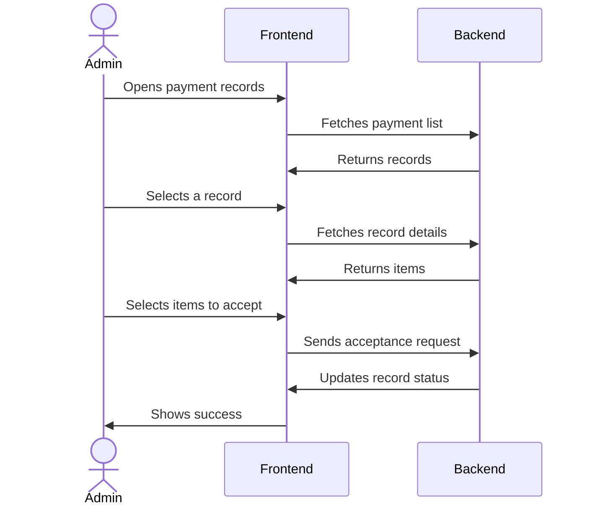
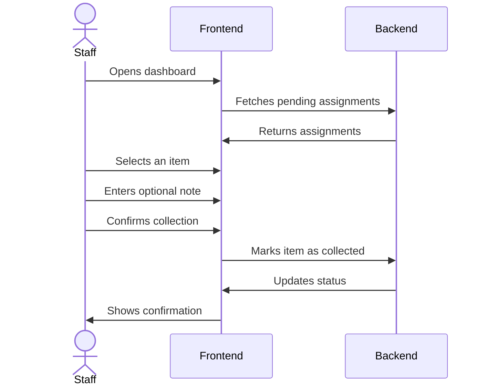

# Primary Colours Schools Portal

A modern school fee management platform that helps administrators and staff track payments, manage fee items, assign responsibilities, and distribute items to students efficiently.

## Overview

Primary Colours Schools Portal takes the pain out of school fee collection and item distribution. It lets parents submit payment evidence online, gives administrators a clear way to review and approve or reject those payments, and automatically routes accepted items to the right staff members for handover. The portal provides separate dashboards for administrative oversight and daily staff assignments, so everyone sees only what they need.

## System Design


The frontend runs as a single-page application in the browser. It talks to a backend API over HTTP, and that API persists data in a database. There is no other external service integration in the current version.

## Features

- Role-based dashboards for administrators and staff
- Payment submission review with item-level acceptance or rejection
- Fee item and role configuration with scope control (global, section, class)
- Staff assignment queue and collection tracking
- PDF export for reports and thermal-style receipts
- Configuration health monitoring that flags items missing roles or staff
- Search, filtering, and pagination across all management screens

### Admin Payment Review and Acceptance

Administrators can review parent payment submissions, inspect evidence, and accept individual items. Accepted items are automatically routed to the appropriate staff based on the item's role.



### Staff Assignment and Collection

Staff members see pending items assigned to them. They can confirm collection and add an optional note. The system records the handover time and the staff member who performed it.



## Installation

### Clone the Repository

```bash
git clone git@github-school:PrimaryColoursSchool01/Primary-Colours-School.git
cd Primary-Colours-School
```

### Install Dependencies

```bash
pnpm install
```

### Set Environment Variables

Create a `.env` file in the project root with the backend API URL:

```bash
VITE_API_URL=http://localhost:5000/api
```

### Run the Development Server

```bash
pnpm dev
```

The app will start at `http://localhost:5173`. Open it in your browser.

### Build for Production

```bash
pnpm build
```

### Preview Production Build

```bash
pnpm preview
```

## Usage

The portal has two main areas: **Admin Panel** and **Staff Panel**.

- **Admin Panel**: After login, administrators are taken to `/dashboard`. They can manage sections, classes, fee items, roles, and users. The dashboard shows payment statistics, revenue breakdown, processing stages, and recent responses. Administrators can review payment submissions in the Responses section, accept or reject items, and export PDF reports. The Configuration section helps identify items that are missing roles or staff assignment.

- **Staff Panel**: Staff members are taken to `/staff` after login. They see a personal dashboard with pending assignments and quick links. Assignments can be searched and filtered. When a staff member marks an item as collected, a confirmation modal appears where they can add an optional note. Collection history shows all past handovers with date, time, and staff information.

Authentication is handled via JSON Web Tokens with refresh token support. Session state is persisted in localStorage and automatically cleared on logout.

## API Documentation

The frontend expects a backend API at the URL defined by `VITE_API_URL`. Below are the endpoints used throughout the application. All requests except authentication endpoints require a valid access token in the `Authorization` header.

### Authentication

#### POST /auth/login

**Description**: Authenticates a user and returns an access token plus user profile.

**Request**:
```json
{
  "email": "admin@primarycolours.edu.ng",
  "password": "securePassword"
}
```

**Response**:
```json
{
  "user": {
    "id": "67f5b0c9e4b0a3f2c4d5e6f7",
    "fullName": "Ahmad Ibrahim",
    "email": "admin@primarycolours.edu.ng",
    "userType": "admin"
  },
  "accessToken": "eyJhbGciOiJIUzI1NiIsInR5cCI6IkpXVCJ9..."
}
```

**Errors**:
- 400: Invalid credentials
- 401: Unauthorized

#### POST /auth/logout

**Description**: Logs out the current user by invalidating the refresh token.

**Request**: No body required.

**Response**:
```json
{
  "message": "Logged out successfully"
}
```

#### POST /auth/refresh-token

**Description**: Exchanges a valid refresh token cookie for a new access token.

**Request**: No body required. Refresh token sent as HTTP-only cookie.

**Response**:
```json
{
  "accessToken": "eyJhbGciOiJIUzI1NiIsInR5cCI6IkpXVCJ9..."
}
```

#### POST /auth/change-password

**Description**: Changes the authenticated user's password.

**Request**:
```json
{
  "currentPassword": "oldPass123",
  "newPassword": "newPass456"
}
```

**Response**:
```json
{
  "message": "Password changed successfully"
}
```

#### POST /auth/forgot-password

**Description**: Sends a password reset link to the provided email.

**Request**:
```json
{
  "email": "user@example.com"
}
```

**Response**:
```json
{
  "message": "Reset link sent if account exists"
}
```

#### POST /auth/reset-password

**Description**: Resets the password using a token from the reset link.

**Request**:
```json
{
  "token": "resetTokenFromEmail",
  "newPassword": "newSecurePass"
}
```

**Response**:
```json
{
  "message": "Password reset successfully"
}
```

### Classes

#### GET /classes

**Description**: Returns all classes, each with its associated section information.

**Response**:
```json
{
  "message": "Classes fetched successfully",
  "classes": [
    {
      "_id": "64b0f2c9e4b0a3f2c4d5e6f8",
      "name": "Primary 1",
      "sectionId": {
        "_id": "64b0f2c9e4b0a3f2c4d5e6f9",
        "name": "Primary"
      },
      "createdAt": "2025-03-01T12:00:00.000Z"
    }
  ]
}
```

#### POST /classes

**Description**: Creates a new class.

**Request**:
```json
{
  "name": "JSS 1",
  "sectionId": "64b0f2c9e4b0a3f2c4d5e6fa"
}
```

**Response**:
```json
{
  "message": "Class created successfully",
  "class": {
    "_id": "64b0f2c9e4b0a3f2c4d5e6fb",
    "name": "JSS 1",
    "sectionId": "64b0f2c9e4b0a3f2c4d5e6fa",
    "createdAt": "2025-03-10T08:00:00.000Z"
  }
}
```

#### GET /classes/:id

**Description**: Returns a single class by ID.

**Response**:
```json
{
  "message": "Class fetched successfully",
  "class": {
    "_id": "64b0f2c9e4b0a3f2c4d5e6fb",
    "name": "JSS 1",
    "sectionId": "64b0f2c9e4b0a3f2c4d5e6fa"
  }
}
```

#### PUT /classes/:id

**Description**: Updates a class name or section.

**Request**:
```json
{
  "name": "JSS 2",
  "sectionId": "64b0f2c9e4b0a3f2c4d5e6fa"
}
```

**Response**:
```json
{
  "message": "Class updated successfully",
  "class": {
    "_id": "64b0f2c9e4b0a3f2c4d5e6fb",
    "name": "JSS 2",
    "sectionId": "64b0f2c9e4b0a3f2c4d5e6fa"
  }
}
```

#### DELETE /classes/:id

**Description**: Deletes a class. Returns the deleted class object.

**Response**:
```json
{
  "message": "Class deleted successfully",
  "class": {
    "_id": "64b0f2c9e4b0a3f2c4d5e6fb",
    "name": "JSS 2"
  }
}
```

### Sections

#### GET /sections

**Description**: Returns all sections, each with its classes.

**Response**:
```json
{
  "message": "Sections fetched successfully",
  "sections": [
    {
      "_id": "64b0f2c9e4b0a3f2c4d5e6f9",
      "name": "Primary",
      "classes": [
        {
          "_id": "64b0f2c9e4b0a3f2c4d5e6f8",
          "name": "Primary 1"
        }
      ],
      "createdAt": "2025-02-20T10:00:00.000Z"
    }
  ]
}
```

#### POST /sections

**Description**: Creates a new academic section.

**Request**:
```json
{
  "name": "Secondary"
}
```

**Response**:
```json
{
  "message": "Section created successfully",
  "section": {
    "_id": "64b0f2c9e4b0a3f2c4d5e6fc",
    "name": "Secondary",
    "createdAt": "2025-03-12T09:30:00.000Z"
  }
}
```

#### GET /sections/:id

**Description**: Returns a single section by ID.

**Response**:
```json
{
  "message": "Section fetched successfully",
  "section": {
    "_id": "64b0f2c9e4b0a3f2c4d5e6fc",
    "name": "Secondary"
  }
}
```

#### PUT /sections/:id

**Description**: Updates a section name.

**Request**:
```json
{
  "name": "Upper Secondary"
}
```

**Response**:
```json
{
  "message": "Section updated successfully",
  "section": {
    "_id": "64b0f2c9e4b0a3f2c4d5e6fc",
    "name": "Upper Secondary"
  }
}
```

#### DELETE /sections/:id

**Description**: Deletes a section and its dependent classes.

**Response**:
```json
{
  "message": "Section deleted successfully",
  "section": {
    "_id": "64b0f2c9e4b0a3f2c4d5e6fc",
    "name": "Upper Secondary"
  }
}
```

### Items (Fee Items)

#### GET /item

**Description**: Returns all fee items.

**Response**:
```json
{
  "data": [
    {
      "_id": "64b0f2c9e4b0a3f2c4d5e6fd",
      "name": "Tuition Fee",
      "price": 75000,
      "compulsory": true,
      "scope": "global",
      "sectionId": null,
      "classIds": [],
      "createdAt": "2025-03-01T08:00:00.000Z"
    }
  ]
}
```

#### GET /item/:id

**Description**: Returns a single fee item.

**Response**:
```json
{
  "data": {
    "_id": "64b0f2c9e4b0a3f2c4d5e6fd",
    "name": "Tuition Fee",
    "price": 75000,
    "compulsory": true,
    "scope": "global",
    "sectionId": null,
    "classIds": []
  }
}
```

#### POST /item

**Description**: Creates a new fee item.

**Request**:
```json
{
  "name": "Sports Fee",
  "price": 5000,
  "compulsory": false,
  "scope": "section",
  "sectionId": "64b0f2c9e4b0a3f2c4d5e6f9",
  "classIds": []
}
```

**Response**:
```json
{
  "data": {
    "_id": "64b0f2c9e4b0a3f2c4d5e6fe",
    "name": "Sports Fee",
    "price": 5000,
    "compulsory": false,
    "scope": "section",
    "sectionId": "64b0f2c9e4b0a3f2c4d5e6f9",
    "classIds": [],
    "createdAt": "2025-03-15T14:00:00.000Z"
  }
}
```

#### PUT /item/:id

**Description**: Updates a fee item.

**Request**:
```json
{
  "name": "Sports Development Fee",
  "price": 6000,
  "compulsory": false,
  "scope": "section",
  "sectionId": "64b0f2c9e4b0a3f2c4d5e6f9",
  "classIds": []
}
```

**Response**:
```json
{
  "data": {
    "_id": "64b0f2c9e4b0a3f2c4d5e6fe",
    "name": "Sports Development Fee",
    "price": 6000,
    "compulsory": false,
    "scope": "section",
    "sectionId": "64b0f2c9e4b0a3f2c4d5e6f9",
    "classIds": []
  }
}
```

#### DELETE /item/:id

**Description**: Deletes a fee item.

**Response**:
```json
{
  "message": "Item deleted successfully"
}
```

### Roles

#### GET /roles

**Description**: Returns all roles, each with scope, section, classes, and items.

**Response**:
```json
{
  "roles": [
    {
      "_id": "64b0f2c9e4b0a3f2c4d5e6ff",
      "name": "Primary Bursar",
      "scope": "section",
      "sectionId": {
        "_id": "64b0f2c9e4b0a3f2c4d5e6f9",
        "name": "Primary"
      },
      "classIds": [],
      "itemIds": [
        {
          "_id": "64b0f2c9e4b0a3f2c4d5e6fd",
          "name": "Tuition Fee"
        }
      ],
      "createdAt": "2025-03-05T10:00:00.000Z"
    }
  ]
}
```

#### POST /roles

**Description**: Creates a new role.

**Request**:
```json
{
  "name": "Secondary Bursar",
  "selectionType": "section-all-classes",
  "sectionId": "64b0f2c9e4b0a3f2c4d5e6fc",
  "classIds": [],
  "itemIds": ["64b0f2c9e4b0a3f2c4d5e6fe"]
}
```

**Response**:
```json
{
  "message": "Role created successfully",
  "role": {
    "_id": "64b0f2c9e4b0a3f2c4d5e700",
    "name": "Secondary Bursar",
    "scope": "section",
    "sectionId": "64b0f2c9e4b0a3f2c4d5e6fc",
    "classIds": [],
    "itemIds": ["64b0f2c9e4b0a3f2c4d5e6fe"]
  }
}
```

#### PUT /roles/:id

**Description**: Updates a role.

**Request**:
```json
{
  "name": "Secondary Bursar",
  "selectionType": "section-specific-classes",
  "sectionId": "64b0f2c9e4b0a3f2c4d5e6fc",
  "classIds": ["64b0f2c9e4b0a3f2c4d5e701"],
  "itemIds": ["64b0f2c9e4b0a3f2c4d5e6fe"]
}
```

**Response**:
```json
{
  "message": "Role updated successfully",
  "role": {
    "_id": "64b0f2c9e4b0a3f2c4d5e700",
    "name": "Secondary Bursar",
    "scope": "class",
    "sectionId": "64b0f2c9e4b0a3f2c4d5e6fc",
    "classIds": ["64b0f2c9e4b0a3f2c4d5e701"],
    "itemIds": ["64b0f2c9e4b0a3f2c4d5e6fe"]
  }
}
```

#### DELETE /roles/:id

**Description**: Deletes a role.

**Response**:
```json
{
  "message": "Role deleted successfully"
}
```

#### GET /roles/:id/dependencies

**Description**: Returns how many users and items are associated with a role.

**Response**:
```json
{
  "data": {
    "users": 2,
    "items": 5
  }
}
```

### Users

#### GET /users

**Description**: Returns all users. Accepts query parameters `limit` and `search`.

**Response**:
```json
{
  "users": [
    {
      "_id": "64b0f2c9e4b0a3f2c4d5e702",
      "fullName": "Jane Doe",
      "email": "jane@school.com",
      "userType": "staff",
      "status": "active",
      "roles": [
        {
          "_id": "64b0f2c9e4b0a3f2c4d5e6ff",
          "name": "Primary Bursar"
        }
      ],
      "createdAt": "2025-02-28T09:00:00.000Z"
    }
  ],
  "total": 1,
  "totalPages": 1
}
```

#### GET /users/:id

**Description**: Returns a single user by ID.

**Response**:
```json
{
  "user": {
    "_id": "64b0f2c9e4b0a3f2c4d5e702",
    "fullName": "Jane Doe",
    "email": "jane@school.com",
    "userType": "staff",
    "status": "active",
    "roles": ["64b0f2c9e4b0a3f2c4d5e6ff"],
    "createdAt": "2025-02-28T09:00:00.000Z"
  }
}
```

#### POST /users

**Description**: Creates a new user.

**Request**:
```json
{
  "fullName": "John Smith",
  "email": "john@school.com",
  "password": "minimum6chars",
  "userType": "staff",
  "roleIds": ["64b0f2c9e4b0a3f2c4d5e6ff"]
}
```

**Response**:
```json
{
  "message": "User created successfully",
  "user": {
    "_id": "64b0f2c9e4b0a3f2c4d5e703",
    "fullName": "John Smith",
    "email": "john@school.com",
    "userType": "staff",
    "status": "active",
    "roles": ["64b0f2c9e4b0a3f2c4d5e6ff"]
  }
}
```

#### PUT /users/:id

**Description**: Updates a user's profile, role, or status.

**Request**:
```json
{
  "fullName": "John Smith Jr.",
  "email": "john@school.com",
  "userType": "staff",
  "roleIds": ["64b0f2c9e4b0a3f2c4d5e6ff"],
  "status": "active"
}
```

**Response**:
```json
{
  "message": "User updated successfully",
  "user": {
    "_id": "64b0f2c9e4b0a3f2c4d5e703",
    "fullName": "John Smith Jr.",
    "email": "john@school.com",
    "userType": "staff",
    "status": "active"
  }
}
```

#### POST /users/:id/no-longer-working

**Description**: Marks a user as no longer working. The account is deactivated but not deleted.

**Response**:
```json
{
  "message": "User marked as no longer working"
}
```

#### POST /users/:id/suspend

**Description**: Suspends a user, preventing login.

**Response**:
```json
{
  "message": "User suspended successfully"
}
```

#### POST /users/:id/unsuspend

**Description**: Re-activates a suspended user.

**Response**:
```json
{
  "message": "User unsuspended successfully"
}
```

#### POST /users/:id/reset-password

**Description**: Resets a user's password and sends them a new temporary password.

**Request**:
```json
{
  "newPassword": "temporaryPass123"
}
```

**Response**:
```json
{
  "message": "Password reset successfully. User has been notified."
}
```

### Payment Records

#### POST /payment-records

**Description**: Creates a new payment record (usually submitted by parents through a public form; not directly used in this admin portal).

**Request**:
```json
{
  "nameOfChild": "Ada Obi",
  "classId": "64b0f2c9e4b0a3f2c4d5e701",
  "nameOfPayerOrCompany": "Chinedu Obi",
  "items": [
    {
      "itemId": "64b0f2c9e4b0a3f2c4d5e6fd",
      "quantity": 1,
      "amountAtPayment": 75000
    }
  ],
  "modeOfPayment": "bank-transfer",
  "bankOrPaymentSourceName": "GTBank",
  "dateOfPayment": "2025-03-18",
  "paymentEvidenceType": "image",
  "paymentEvidenceImage": "base64String"
}
```

**Response**:
```json
{
  "message": "Payment record created",
  "paymentRecord": {
    "_id": "64b0f2c9e4b0a3f2c4d5e704",
    "status": "pending"
  }
}
```

#### GET /payment-records

**Description**: Returns paginated payment records with optional filters for search, status, and date range.

**Query Parameters**: `page`, `limit`, `search`, `status`, `startDate`, `endDate`

**Response**:
```json
{
  "paymentRecords": [
    {
      "_id": "64b0f2c9e4b0a3f2c4d5e704",
      "nameOfChild": "Ada Obi",
      "classId": {
        "_id": "64b0f2c9e4b0a3f2c4d5e701",
        "name": "Primary 1"
      },
      "nameOfPayerOrCompany": "Chinedu Obi",
      "totalAmount": 75000,
      "status": "pending",
      "dateOfPayment": "2025-03-18T00:00:00.000Z",
      "createdAt": "2025-03-18T10:30:00.000Z"
    }
  ],
  "total": 1,
  "totalPages": 1
}
```

#### GET /payment-records/:id

**Description**: Returns a single payment record with full item details and evidence.

**Response**:
```json
{
  "paymentRecord": {
    "_id": "64b0f2c9e4b0a3f2c4d5e704",
    "nameOfChild": "Ada Obi",
    "classId": {
      "_id": "64b0f2c9e4b0a3f2c4d5e701",
      "name": "Primary 1"
    },
    "nameOfPayerOrCompany": "Chinedu Obi",
    "items": [
      {
        "_id": "64b0f2c9e4b0a3f2c4d5e705",
        "itemId": {
          "_id": "64b0f2c9e4b0a3f2c4d5e6fd",
          "name": "Tuition Fee"
        },
        "quantity": 1,
        "amountAtPayment": 75000,
        "status": "pending"
      }
    ],
    "totalAmount": 75000,
    "status": "pending",
    "dateOfPayment": "2025-03-18T00:00:00.000Z",
    "paymentEvidenceType": "image",
    "paymentEvidenceImage": "base64String"
  }
}
```

#### PUT /payment-records/:id

**Description**: Performs an accept or reject action on a payment record. Accept requires `acceptedItemIds` array; reject requires `rejectionReason` string.

**Request for Accept**:
```json
{
  "action": "accept",
  "acceptedItemIds": ["64b0f2c9e4b0a3f2c4d5e705"]
}
```

**Request for Reject**:
```json
{
  "action": "reject",
  "rejectionReason": "Payment amount does not match"
}
```

**Response**:
```json
{
  "message": "Payment record updated successfully",
  "paymentRecord": {
    "_id": "64b0f2c9e4b0a3f2c4d5e704",
    "status": "accepted"
  }
}
```

### Dashboard

#### GET /dashboard

**Description**: Returns admin dashboard data: statistics, monthly submissions, revenue breakdown, pipeline status, and recent responses.

**Response**:
```json
{
  "data": {
    "stats": {
      "total": 120,
      "pending": 15,
      "partially_accepted": 4,
      "accepted": 90,
      "rejected": 11,
      "totalRevenue": 6500000,
      "pendingRevenue": 750000
    },
    "monthlySubmissions": [
      {
        "month": "Feb",
        "count": 14
      }
    ],
    "revenueBreakdown": [
      {
        "name": "Tuition Fee",
        "value": 60,
        "totalAmount": 4500000,
        "count": 55,
        "color": "#136dec"
      }
    ],
    "pipelineStatus": [
      {
        "stage": "Pending",
        "count": 15,
        "description": "Awaiting review",
        "percentage": 12,
        "color": "#10b981"
      }
    ],
    "recentResponses": []
  }
}
```

#### GET /dashboard/recent

**Description**: Returns recent payment responses, paginated.

**Query Parameters**: `page`, `limit`

**Response**:
```json
{
  "data": {
    "recentResponses": [
      {
        "_id": "64b0f2c9e4b0a3f2c4d5e704",
        "nameOfChild": "Ada Obi",
        "classId": {
          "name": "Primary 1"
        },
        "nameOfPayerOrCompany": "Chinedu Obi",
        "totalAmount": 75000,
        "status": "pending",
        "createdAt": "2025-03-18T10:30:00.000Z"
      }
    ]
  }
}
```

### Configuration

#### GET /configuration-health

**Description**: Returns configuration health summary: items without roles, items with roles but no staff, and affected transactions.

**Response**:
```json
{
  "data": {
    "summary": {
      "noRoleItemsCount": 2,
      "noStaffItemsCount": 1,
      "totalAffectedTransactions": 5
    },
    "noRoleItems": [
      {
        "itemId": "64b0f2c9e4b0a3f2c4d5e6fe",
        "itemName": "Sports Development Fee",
        "affectedTransactions": 3
      }
    ],
    "noStaffItems": [
      {
        "itemId": "64b0f2c9e4b0a3f2c4d5e6fd",
        "